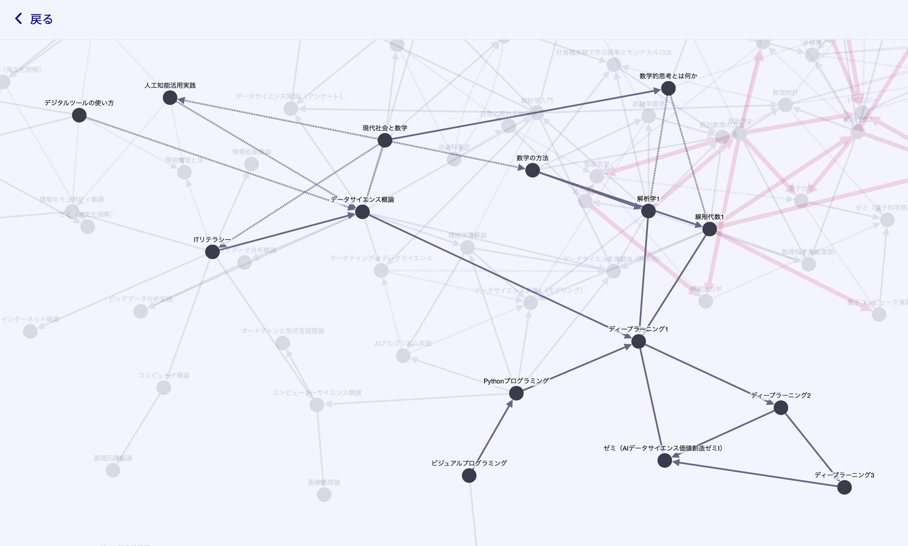

# zen-univ-curriculum-graph-react



"ZEN大 カリキュラム・グラフ (React版)" は、ZEN大学の前提科目・後継科目とそのグラフを閲覧できるWebサイトです。

ZEN大学の前提科目・後継科目の情報はスプレッドシート形式で提供されているため、全体像の把握が困難です。"ZEN大 カリキュラム・グラフ" はシラバスの前提科目・後継科目情報を有向グラフの形で閲覧できるようにします。

このWebサイトは大学が公式に提供しているものではありません。履修登録を行う際はシラバス、カリキュラム・ツリー、カリキュラム・マップを必ずご確認ください。

## Webページ

http://zen-univ-curriculum-graph.igarin14pm.com/

## 使用技術 (技術スタック)

- **フレームワーク**: React 19.2.7 / Vite 8.1.3
- **言語**: TypeScript 6.0.3
- **有向グラフ描画**: Cytoscape.js 3.34.0
- **科目検索**: Fuse.js 7.4.2
- **コード整形**: ESLint 10.6.0

## ローカルでの開発環境の構築

### 前提条件

- Node.js (v24.20.0 で確認)

### 手順

```bash
# 1. リポジトリをクローン
git clone https://github.com/igarin14pm/zen-univ-curriculum-graph-react.git

# 2. ディレクトリを移動
cd zen-univ-curriculum-graph-react

# 3. 依存関係をインストール
npm install

# 4. アプリケーションを起動
npm run dev
```

## ディレクトリ構成

```
.
├── public/
│   └── images/ - Favicon・OGP画像
└── src/
    ├── app/
    │   ├── components/ - アプリ共通のコンポーネント
    │   └── pages/ - 個別ページ
    │       ├── contact-page/ - "お問い合わせ" ページ
    │       ├── global-graph-page/ - "グローバルグラフ" ページ
    │       ├── home-page/ - "Home" ページ
    │       ├── http-status-code-404-page/ - 404 ページ
    │       ├── subject-detail-page/ - 科目詳細ページ
    │       └── subjects-page/ - 科目一覧ページ
    ├── data/ - 科目情報を格納したディレクトリ
    ├── graph/ - Cytoscape.js 関連のコード
    ├── images/ - ロゴの画像ファイルを格納したディレクトリ
    └── types/ - 型を定義した TypeScript ファイル
```

## ライセンス

このリポジトリは MIT License のもとで公開されています。  
[MIT License](./LICENSE)
